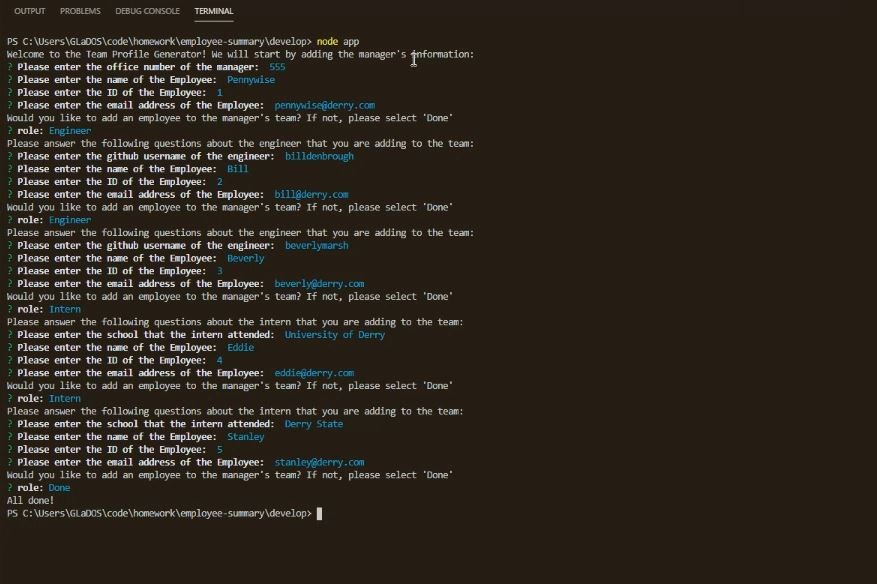
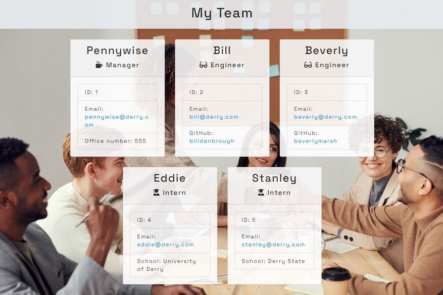

# Team Generator

## Table of Contents
* [Description](#description)
* [Installation](#installation)
* [Application Usage](#usage)
* [Contributors](#contributors)
* [Testing](#testing)
* [Contact Me](#contact)
## Description 
* Allows a user to enter input into node CLI to create an employee roster including a manager with options to create multiple engineers and/or interns on the team. Once the user inputs the manager's information and all of their employees the application will create an html file that will render the user's input.
## See The Application
* [Application in use!](https://drive.google.com/file/d/1s0WgPSTN3mRqNStruRO53Od9RI95cGix/view)
* [Read Me Generator](https://github.com/dianalynshull/Team-Generator)
## Installation 
* Open your desired terminal. Enter "npm i" and it will install all necessary modules
## Application Usage 
* With user input creates an html file that will display all of your teammembers!
## Contributors 
* [Pexels - User fauxels](https://www.pexels.com/photo/group-of-people-sitting-indoors-3184291/)
* [Bootstrap](https://getbootstrap.com/)
## Running Tests 
* Open your terminal and enter "npm test". This will run jest. If there are any errors they will be notated, otherwise it will show all of the tests as successful!
## License
* [GNU GPLv3](https://choosealicense.com/licenses/gpl-3.0/)
## Questions? Contact Me! 
* Github: https://github.com/dianalynshull
* Email: dianalynshull@gmail.com
* Preferred Contact: Email